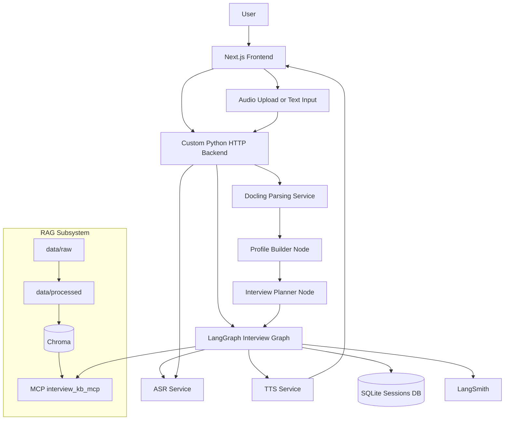

# ARCHITECTURE

## 1. Цель проекта

Проект: AI-ассистент для подготовки к техническим собеседованиям с голосовым mock-интервью.

Цель MVP: помочь кандидату на конкретную вакансию пройти короткое тренировочное интервью, получить оценку ответов, карту пробелов и итоговый coaching report с темами для повторения.

## 2. Границы MVP

### Входит в MVP

- web-интерфейс для загрузки резюме и вакансии
- настройка интервью: роль, seniority, режим, язык, длительность, voice/text mode
- парсинг `PDF`, `DOCX`, текста вакансии и HTML-вакансии
- построение `candidate_profile`, `job_profile`, `skill_gap_map`
- LangGraph workflow с planner, interviewer, evaluator, follow-up loop и report generation
- RAG по курируемой базе вопросов, конспектов и rubric-материалов
- voice flow: `speech-to-text` для ответа кандидата и `text-to-speech` для вопросов интервьюера
- custom MCP server `interview_kb_mcp`
- custom Skill `Interview Coach`
- tracing через LangSmith
- golden dataset и A/B baseline для evaluator / retrieval

### Не входит в MVP

- live streaming voice call и real-time duplex audio
- enterprise auth и многопользовательские кабинеты
- live avatar или video pipeline
- покрытие большого числа профессий
- production-grade billing, rate limiting и background queue orchestration

## 3. User Journey

Основной пользовательский путь:

1. Пользователь открывает web-app и выбирает старт нового mock-интервью.
2. Загружает резюме в `PDF` или `DOCX`.
3. Вставляет текст вакансии или ссылку на вакансию.
4. Выбирает параметры: роль, seniority, режим интервью, язык, длительность, voice mode.
5. Система парсит документы, строит intake-артефакты кандидата и вакансии и показывает темы интервью.
6. Пользователь запускает интервью.
7. AI-интервьюер задаёт вопрос голосом и текстом.
8. Пользователь отвечает голосом или, если voice недоступен, текстом.
9. Система делает STT, оценивает ответ, при необходимости задаёт follow-up.
10. После 4-6 вопросов система завершает сессию и показывает отчёт.
11. Пользователь получает итоговый score, сильные стороны, пробелы, темы для повторения и тренировочные вопросы.

## 4. Product Decisions

### Роли MVP

Для первой версии фиксируем ограниченный scope:

- `Frontend Developer`

### Seniority MVP

- `Junior`
- `Middle`

Причина: этого достаточно, чтобы показать role-aware planning и gap-based интервью, не раздувая RAG-базу до неуправляемого объёма.

### Interview modes MVP

- `Technical Core`
- `Behavioural`
- `Mixed`

### Bonus backlog

- `System Design` только после стабилизации core flow

### Языки MVP

- язык интерфейса: `Russian`
- язык интервью: `Russian` и `English`

Интерфейс можно держать русскоязычным, а саму сессию интервью проводить на выбранном языке.

## 5. Набор тем для MVP

### Frontend Developer

- Vue 3 component model
- Vue reactivity and refs
- Nuxt 3 fundamentals
- Nuxt routing and data fetching
- TypeScript in frontend apps
- Browser rendering and event loop
- API integration and async flows
- Performance and optimization basics
- Resume-based project deep dive
- Behavioural examples: ownership, incident handling, prioritization

### Cross-role behavioural themes

- conflict resolution
- trade-off communication
- ownership and accountability
- learning from failure
- prioritization under deadlines

## 6. Tech Stack

### Frontend

- `Next.js 15`
- `React 19`
- `TypeScript`
- `Tailwind CSS`
- `shadcn/ui`
- `TanStack Query` for API state
- browser `MediaRecorder` API for audio capture

Почему такой выбор:

- быстро собирается web MVP
- удобно делать form flow, session pages и audio controls
- TypeScript снижает число интеграционных ошибок между UI и backend

### Backend and API

- `Python 3.11`
- встроенный HTTP API на `BaseHTTPRequestHandler` + `ThreadingHTTPServer`
- JSON / multipart endpoints для session lifecycle
- `SQLite` for MVP session storage
- файловое хранилище для uploaded resume / audio artifacts

Почему:

- Python нужен для LangGraph, Docling и voice/RAG integration
- для MVP достаточно лёгкого встроенного HTTP server без дополнительного ASGI-стека
- это уменьшает инфраструктурную сложность и ускоряет локальный demo setup
- SQLite достаточно для одиночного MVP и не усложняет инфраструктуру

### Agent Orchestration

- `LangGraph`
- RAG + heuristic evaluator as current interview runtime baseline
- `OpenAI gpt-4o-mini` as current LLM-backed analysis model
- optional LLM final phrasing layer for selected interview questions

Текущий status по LLM:

- основной interview loop сейчас работает через `LangGraph` + `RAG` + `MCP` + heuristic scoring
- прямой LLM-вызов в текущем коде используется в первую очередь для `HR-style resume/vacancy analysis`
- для interviewer layer дополнительно включён optional final phrasing step: он полирует уже выбранный curated question candidate, но не заменяет source selection
- это важно явно проговаривать на защите, чтобы документация совпадала с реальной реализацией

### Documents

- `Docling` as primary parser for `PDF`, `DOCX`, `HTML`
- `Playwright` only as fallback for dynamic vacancy pages

### RAG

- embeddings: `text-embedding-3-large`
- vector DB: `Chroma`
- retrieval: `top-k` + metadata filters
- optional reranker later in A/B stage

Почему:

- `text-embedding-3-large` даёт более качественное semantic retrieval для небольшой curated KB
- `Chroma` проще всего поднять локально и хранить прямо в проекте
- reranker не обязателен в первой итерации, но должен быть предусмотрен архитектурно

### Voice

- ASR: `whisper-1`
- TTS: `fal-ai/minimax/speech-02-hd`

### Model Choice and Hyperparameters

#### Текущий LLM-backed baseline

- основной LLM-вызов в текущей реализации: `OpenAI gpt-4o-mini`
- текущий сценарий использования:
  - `HR-style resume / vacancy analysis`
  - optional final phrasing для `main question` и `follow-up`
  - structured JSON output для match analysis
  - enrichment поверх deterministic intake pipeline

#### Почему выбрана именно эта модель

- `gpt-4o-mini` даёт хороший баланс `cost / latency / quality` для MVP
- модель достаточно быстрая для интерактивного локального demo
- стоимость ниже, чем у более тяжёлых reasoning-моделей
- качества хватает для:
  - extraction-like анализа резюме и вакансии
  - структурированного JSON output
  - коротких HR-style reasoning задач

#### Текущие inference settings

Для `HR analysis` сейчас используются:

- `temperature=0.2`
- `max_tokens=2200`
- `top_p` не переопределяется, используется provider default

Для `question final phrasing` сейчас используются:

- `temperature=0.15`
- `max_tokens=120`
- `top_p` не переопределяется, используется provider default

#### Почему выбраны именно такие параметры

- низкая `temperature` уменьшает variance и помогает получать более стабильный structured JSON
- `max_tokens=2200` достаточно для подробного match analysis без чрезмерного раздувания latency и стоимости
- ещё более низкая `temperature` и короткий `max_tokens` в phrasing-слое помогают не переизобретать вопрос, а только аккуратно полировать уже выбранный candidate
- `top_p` оставлен по умолчанию, потому что в этом сценарии основная управляемость уже достигается через низкую `temperature`

#### Trade-off: cost / latency / quality

- `gpt-4o-mini` выбран как pragmatic MVP baseline:
  - дешевле, чем `gpt-4.1`
  - быстрее отвечает на long-context intake analysis
  - немного уступает более сильным моделям в глубине reasoning
- для текущего этапа это осознанный trade-off в пользу:
  - скорости итерации
  - стоимости demo
  - стабильности structured output

#### Планируемая следующая итерация

- если проект будет углубляться в fully LLM-driven planner / interviewer / evaluator loop, логичный следующий кандидат для A/B:
  - `gpt-4.1` для planner / interviewer
  - `gpt-4o-mini` или другой более дешёвый вариант для вспомогательных шагов

Это стоит показывать как осознанный roadmap, а не как расхождение между ТЗ и кодом.

### Observability and evals

- tracing: `LangSmith`
- eval dataset: `JSONL`
- offline eval runner: Python scripts

### Custom components

- MCP server: `mcp_servers/interview_kb_mcp/server.py`
- Skill: `skills/interview_coach/SKILL.md`

## 7. Logical Architecture

## 8. LangGraph Workflow

Текущий рабочий state graph в коде:

1. `planner`
   Собирает или восстанавливает `interview_plan`, определяет текущую тему и подтягивает кандидаты вопросов через `search_interview_questions`.
2. `interviewer`
   Формирует следующий вопрос: либо обычный вопрос по теме, либо follow-up на основе предыдущей оценки. Источник кандидатов остаётся детерминированным (`question_bank` / `followup_bank`), после чего optional LLM final phrasing делает формулировку более естественной и затем повторно прогоняется через sanitizer.
3. `evaluator`
   Прогоняет heuristic evaluation и обогащает его через `get_evaluation_rubric` и `get_topic_cheatsheet`.
4. `feedback`
   Готовит короткий feedback по последнему ответу.
5. `decision`
   Решает: follow-up, next topic или finish interview. Для follow-up использует `get_followup_questions`.
6. `report`
   Собирает итоговый session report и добавляет coaching block через custom Skill `Interview Coach`.

Что важно для синхронизации с реализацией:

- parsing и intake analysis происходят до запуска interview graph в API-слое
- голосовой ответ сначала транскрибируется отдельным backend service, затем уже передаётся в graph как текст
- итоговый report сейчас собирается через deterministic + RAG-aware pipeline, а не через отдельный full-LLM report generator

Условия ветвления:

- если ответ поверхностный и лимит follow-up не исчерпан: `follow-up`
- если тема раскрыта: `next question`
- если достигнут лимит времени или вопросов: `finish interview`

## 9. Data Model

### Application data

Текущая SQLite-схема:

- `sessions`
- `session_documents`
- `session_turns`
- `session_profiles`
- `session_workflows`

Ключевые поля:

- interview settings
- parsed profile artifacts
- question / answer / feedback per turn
- transcript
- score
- follow-up decision
- retrieved document references
- trace id

### RAG data

- `data/raw/`
- `data/processed/`
- `data/vectordb/`

### Evals data

- `backend/evals/answer_evaluation_golden_dataset.jsonl`
- `backend/evals/run_golden_eval.py`
- `backend/evals/ab_tests.py`

## 10. Источники данных для RAG

### Принцип отбора

Для MVP не используем бесконтрольный веб-скрапинг как основной источник. База должна быть проверяемой, компактной и размеченной.

### Основные источники

1. Собственные markdown-конспекты по темам интервью
2. Curated question banks по `Frontend`
3. Rubrics оценки ответов по типам вопросов
4. Cheatsheets по ключевым темам
5. Role-specific interview notes по `Junior` и `Middle`
6. Behavioural question bank с примерами сильных структур ответа

### Предпочтительные первоисточники для подготовки материалов

- официальная документация `Vue`, `Nuxt`, `TypeScript`, `MDN`
- собственные summary-заметки по HTTP, rendering, performance и behavioural patterns
- вручную отобранные interview prep guides
- заранее подготовленные vacancy archetypes

### Что попадёт в `data/raw/`

- `frontend/questions/*.md`
- `frontend/cheatsheets/*.md`
- `behavioural/*.md`
- `rubrics/*.md`
- `vacancy_archetypes/*.md`

### Metadata schema для chunk'ов

- `role`
- `seniority`
- `topic`
- `interview_type`
- `language`
- `document_type`
- `source`

## 11. RAG Strategy

### Chunking baseline

- chunk size: `600-800 tokens`
- overlap: `80-120 tokens`

### Chunking rules by document type

- question bank: один вопрос, answer outline и rubric hints держать вместе
- cheatsheet: chunk по подтемам, а не по фиксированной длине
- rubric docs: chunk по критериям оценки

### Retrieval baseline

- `top_k=4` for question generation
- `top_k=4` for evaluator rubric retrieval
- `top_k=6` for final study recommendations
- metadata filtering by `role`, `seniority`, `topic`, `interview_type`

## 12. Security and Guardrails

- очищать resume/job text от инструкций, похожих на prompt injection
- не передавать сырые пользовательские документы прямо в prompt без normalization
- ограничивать ответы рамкой interview prep use case
- при пустом retrieval использовать fallback questions из базового planner logic
- при падении voice-сервисов переключаться на text mode

## 13. Список обязательных компонентов

- `frontend/` web app with upload, settings, interview and report screens
- `backend/api/` REST endpoints for session lifecycle
- `backend/graph/` LangGraph workflow
- `backend/services/parser.py` for Docling parsing
- `backend/services/rag.py` for retrieval
- `backend/services/asr.py` and `backend/services/tts.py`
- `backend/storage/` session persistence
- `backend/evals/` with golden dataset and eval runners
- `mcp_servers/interview_kb_mcp/`
- `skills/interview_coach/`
- `data/raw`, `data/processed`, `data/vectordb`
- `.env.example`, `README.md`, `EVALS.md`

## 14. Decisions for Stage 1

Сразу после discovery имеет смысл идти в таком порядке:

1. Поднять каркас `frontend + backend`.
2. Реализовать создание сессии и upload endpoints.
3. Зафиксировать JSON response contracts для profiles, plan, evaluation, report.
4. Подготовить директории `data/` и шаблоны для knowledge base.
5. Собрать первый исполняемый LangGraph baseline.
